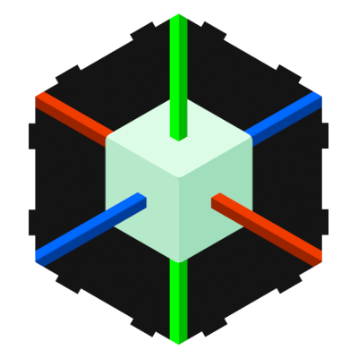
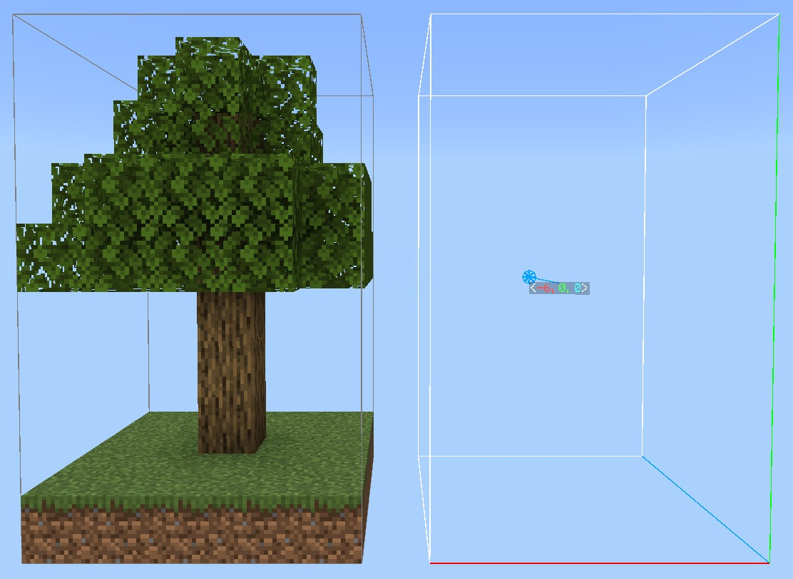

    
    
<b>Nudge</b>

[-brightgreen)](https://feedback.minecraft.net/hc/en-us/sections/360001186971-Release-Changelogs)

---

Nudge is a powerful creative building addon for Minecraft Bedrock Edition. Inspired by the simple tools from moulberry's Axiom, it is designed to give creators quick, intuitive control over their builds.

* **Selections**: Speedily define areas by clicking on blocks from any distance.

* **Nudge Controls**: Nudge areas of blocks one step at a time using the vanilla movement controls.

* **Large-Area Editing**: Perform edits of any size anywhere, anytime.

* **Modes**: Switch between editing modes (moving, cloning, stacking, deleting, etc.) to make different kinds of edits fluidly.

* **Undo/Redo**: Easily undo and redo your last actions.

* **Built for Simplicity**: No complex UIs or commands. Just fast, easy-to-master tools.

    
    
<i><a href="https://youtu.be/HvZ565d1T4w">Click here to watch a brief demo of Nudge</a></i>

## Usage

Download the latest release of **Nudge** from the [Releases Page](https://github.com/ForestOfLight/Nudge/releases). Install it like any other addon, making sure the **Beta APIs** experiment is enabled.

> [!IMPORTANT]
> This addon will not work on Realms until Mojang enables support for the `@minecraft/debug-utilities` scripting module.
>
> Using Nudge with Editor Mode will also cause Nudge not to render properly.

### Getting Started

Once installed on a world:

1. Use `/nudge:nudge` to get the Nudge item.
2. "Hit" with the item to start selecting an area or "Use" it to change the edit mode.
3. Instructions in-game will guide you through making edits.

Nudge is designed to feel natural and quick - a companion tool for faster iteration.

### Additional Commands

**`/nudge:undo <amount: int>`** - Undoes the last edit action, or several.

**`/nudge:redo <amount: int>`** - Redoes the last undone edit action, or several.

**`/nudge:here`** - Starts, extends, or nudges your selection to your current location.

### Server Installation

Before installing on a server, make sure the `config/default/permissions.json` file contains `"@minecraft/debug-utilities"`. Add it if not. Then, installing Nudge on a server is the same as installing any other addon.

## Join the Community

Need help, want to discuss technical Minecraft, or follow future updates?
[**Join our Discord!**](https://discord.gg/9KGche8fxm)

## Roadmap

* [x] Selection system
* [x] Nudge system
* [x] Move edit
* [x] Undo / Redo
* [x] Clone edit
* [x] Selection rotation / mirroring
* [x] Delete edit
* [x] Stack edit
* [x] Arbitrarily sized edits
* [x] Ticking areas for edits
* [x] Entities affected by edits
* [x] Translation support
* [x] Magic Delete edit
* [x] Extrude edit
* [x] Symmetry Building
* [ ] Preview visualizations

## Issues & Suggestions

Have an idea? Found a bug?
Open an issue on this repo - feedback is always welcome.

If you're interested in contributing, feel free to open a pull request!

### Adding Translations

Nudge currently only supports American English, but has translation capabilities. If you would like to contribute a translation, please join our Discord and reach out!
